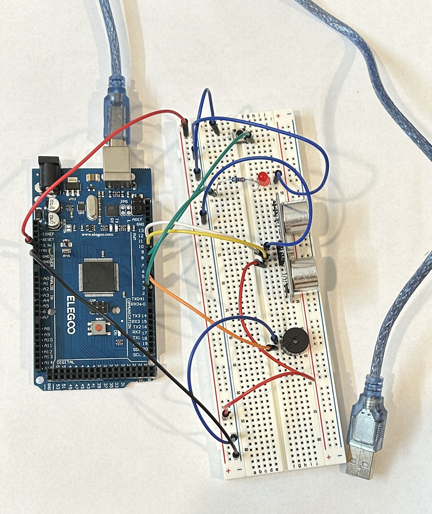

# Simple Burglar Alarm

This project combines what you have learnt in the Actuators and Sensors lessons. The goal is to create an alarm with flashing lights and a buzzer if a person gets too close.

You will need:
1. Arduino Mega 2560 R3
2. LED
3. 220 Ohm resistor
4. Buzzer
5. Ultrasonic sensor
6. Push button
7. Breadboard
8. Jumper wires
9. Computer with Arduino IDE and USB cable

## Algorithm

You will need to continuously check the distance from the closest object using an ultrasonic sensor. If an object is less than 5 cm away, start the alarm! The buzzer and LED should beep and flash respectively until the button is pressed, which turns the alarm off.

## Wiring

Refer to the image below as a guide. Note that if you change the pin in which the component is plugged, you will also need to change the variable in the `SimpleBurglarAlarm.ino` file.

